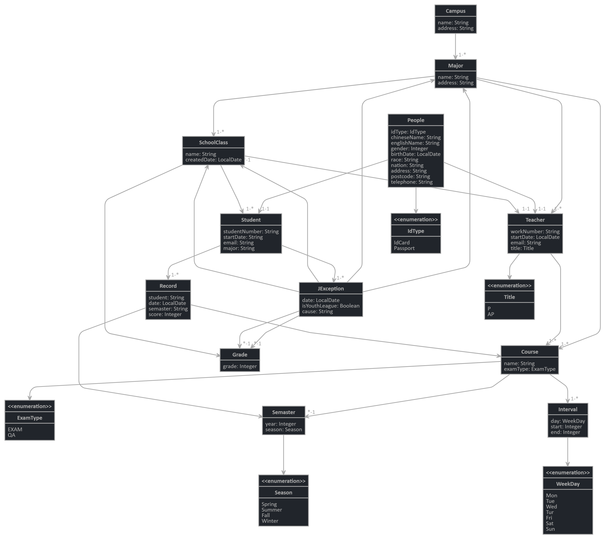

# 数据库大作业 —— 牛岱、朱瀚飞、凌海锋、雷洋、王鸣昊

## 项目简介

项目使用 _Spring Boot_ 作为后端开发框架，_Angular_ 作为前端开发框架，_Mysql_ 作为生产环境数据库，_Docker_ 作为生产环境部署方式，是一个全栈 Responsive 的 Web 应用，提供基本 USTC 信息库的增删查改操作。

## 项目文件结构

```
.
├── src
│   ├── main
│   │   ├── docker // docker 部署代码
│   │   │   ├── grafana
│   │   │   │   └── provisioning
│   │   │   │       ├── dashboards
│   │   │   │       └── datasources
│   │   │   └── prometheus
│   │   ├── java // java 后端代码
│   │   │   └── com
│   │   │       └── mycompany
│   │   │           └── myapp
│   │   │               ├── aop
│   │   │               │   └── logging
│   │   │               ├── config
│   │   │               │   └── audit
│   │   │               ├── domain // 实体 pojo 定义
│   │   │               │   └── enumeration
│   │   │               ├── repository // 数据库表定义
│   │   │               │   └── search
│   │   │               ├── security // 安全
│   │   │               │   └── jwt
│   │   │               ├── service // 服务 controller
│   │   │               │   ├── dto
│   │   │               │   └── mapper
│   │   │               └── web
│   │   │                   └── rest
│   │   │                       ├── errors
│   │   │                       └── vm
│   │   ├── jib
│   │   ├── resources // 配置数据相关静态资源
│   │   │   ├── config
│   │   │   │   ├── liquibase // 数据库重构版本控制
│   │   │   │   │   ├── changelog
│   │   │   │   │   ├── data
│   │   │   │   │   └── fake-data
│   │   │   │   └── tls // tls 配置
│   │   │   ├── i18n // 国际化模块
│   │   │   └── templates // 模板
│   │   │       └── mail // 邮件模板
│   │   └── webapp // 前端代码
│   │       ├── WEB-INF
│   │       ├── app
│   │       │   ├── account // 账号相关
│   │       │   │   ├── activate
│   │       │   │   ├── password
│   │       │   │   ├── password-reset
│   │       │   │   │   ├── finish
│   │       │   │   │   └── init
│   │       │   │   ├── register
│   │       │   │   └── settings
│   │       │   ├── admin // 管理页面
│   │       │   │   ├── audits
│   │       │   │   ├── configuration
│   │       │   │   ├── docs
│   │       │   │   ├── health
│   │       │   │   ├── logs
│   │       │   │   ├── metrics
│   │       │   │   └── user-management
│   │       │   ├── blocks
│   │       │   │   ├── config
│   │       │   │   └── interceptor
│   │       │   ├── core
│   │       │   │   ├── auth
│   │       │   │   ├── icons
│   │       │   │   ├── language
│   │       │   │   ├── login
│   │       │   │   └── user
│   │       │   ├── entities // 实体页面
│   │       │   │   ├── campus
│   │       │   │   ├── course
│   │       │   │   ├── grade
│   │       │   │   ├── interval
│   │       │   │   ├── j-exception
│   │       │   │   ├── major
│   │       │   │   ├── people
│   │       │   │   ├── record
│   │       │   │   ├── school-class
│   │       │   │   ├── semaster
│   │       │   │   ├── student
│   │       │   │   └── teacher
│   │       │   ├── home // 首页
│   │       │   ├── layouts // 模板
│   │       │   │   ├── error
│   │       │   │   ├── footer
│   │       │   │   ├── main
│   │       │   │   ├── navbar
│   │       │   │   └── profiles
│   │       │   └── shared // 共享库
│   │       │       ├── alert
│   │       │       ├── auth
│   │       │       ├── constants
│   │       │       ├── language
│   │       │       ├── login
│   │       │       ├── model
│   │       │       │   └── enumerations
│   │       │       └── util
│   │       ├── content
│   │       │   ├── css
│   │       │   ├── images
│   │       │   └── scss
│   │       ├── i18n
│   │       │   ├── en
│   │       │   └── fr
│   │       └── swagger-ui
│   │           └── dist
│   │               └── images
│  
└── webpack // webpack 相关配置
```

## 数据库表设计：



## 后端设计

# **后端**

## **概要**

- 以 Java 为后端开发语言，以 MySQL 为数据库管理系统
- 以 Spring Boot 作为后端的开发框架
- 使用 Java 普通对象（POJO）与数据库表建立映射关系。

## **实体配置**

### **Campus**


```java
@Table(name = "campus")
public class Campus implements Serializable {
  private static final long serialVersionUID = 1L;

  @Id
  @GeneratedValue(strategy = GenerationType.IDENTITY)
  private Long id;

  @Column(name = "name")
  private String name;

  @Column(name = "address")
  private String address;
}
```

#### 关联

Campus 关联到 Major

```java
@OneToMany(mappedBy = "campus")
@Cache(usage = CacheConcurrencyStrategy.NONSTRICT_READ_WRITE)
private Set<Major> majors = new HashSet<>();
```

### **Major**


```java
@Table(name = "major")
public class Major implements Serializable {
  private static final long serialVersionUID = 1L;

  @Id
  @GeneratedValue(strategy = GenerationType.IDENTITY)
  private Long id;

  @Column(name = "name")
  private String name;
}
```

#### 关联

Major 关联到 SchoolClass，Teacher，Course

```java
@OneToMany(mappedBy = "major")
@Cache(usage = CacheConcurrencyStrategy.NONSTRICT_READ_WRITE)
private Set<SchoolClass> schoolClasses = new HashSet<>();

@OneToMany(mappedBy = "major")
@Cache(usage = CacheConcurrencyStrategy.NONSTRICT_READ_WRITE)
private Set<Teacher> teachers = new HashSet<>();

@OneToMany(mappedBy = "major")
@Cache(usage = CacheConcurrencyStrategy.NONSTRICT_READ_WRITE)
private Set<Course> courses = new HashSet<>();
```

反向关联到 Campus 可提高执行效率，下同

```java
@ManyToOne
@JsonIgnoreProperties("majors")
private Campus campus;
```

### **SchoolClass**


```java
@Table(name = "school_class")
public class SchoolClass implements Serializable {
  private static final long serialVersionUID = 1L;

  @Id
  @GeneratedValue(strategy = GenerationType.IDENTITY)
  private Long id;

  @Column(name = "name")
  private String name;

  @Column(name = "created_date")
  private LocalDate createdDate;
}
```

#### 关联

SchoolClass 关联到 Student，Grage，Major

```java
@OneToOne
 @JoinColumn(unique = true)
private Teacher master;

@OneToMany(mappedBy = "schoolClass")
@Cache(usage = CacheConcurrencyStrategy.NONSTRICT_READ_WRITE)
private Set<Student> students = new HashSet<>();

@ManyToOne
@JsonIgnoreProperties("schoolClasses")
private Grade grade;

@ManyToOne
@JsonIgnoreProperties("schoolClasses")
private Major major;
```

### **Teacher**


```java
@Table(name = "teacher")
public class Teacher implements Serializable {
  private static final long serialVersionUID = 1L;

  @Id
  @GeneratedValue(strategy = GenerationType.IDENTITY)
  private Long id;

  @Column(name = "work_number")
  private String workNumber;

  @Column(name = "start_date")
  private LocalDate startDate;

  @Column(name = "email")
  private String email;

  @Enumerated(EnumType.STRING)
  @Column(name = "title")
  private Title title;
}
```

#### 关联

Teacher 关联到 SchoolClass,People,Major

```java
@OneToMany(mappedBy = "teacher")
@Cache(usage = CacheConcurrencyStrategy.NONSTRICT_READ_WRITE)
private Set<Course> courses = new HashSet<>();

@OneToOne(mappedBy = "master")
@JsonIgnore
private SchoolClass schoolClass;

@OneToOne(mappedBy = "teacher")
@JsonIgnore
private People people;

@ManyToOne
@JsonIgnoreProperties("teachers")
private Major major;
```

### **Course**


```java
@Table(name = "course")
public class Course implements Serializable {
  private static final long serialVersionUID = 1L;

  @Id
  @GeneratedValue(strategy = GenerationType.IDENTITY)
  private Long id;

  @Column(name = "name")
  private String name;

  @Enumerated(EnumType.STRING)
  @Column(name = "exam_type")
  private ExamType examType;
}
```

#### 关联

Course 关联到 Semaster，Major，Teacher

```java
@OneToMany(mappedBy = "course")
@Cache(usage = CacheConcurrencyStrategy.NONSTRICT_READ_WRITE)
private Set<Interval> times = new HashSet<>();

@ManyToOne
@JsonIgnoreProperties("courses")
private Semaster semaster;

@ManyToOne
@JsonIgnoreProperties("courses")
private Major major;

@ManyToOne
@JsonIgnoreProperties("courses")
private Teacher teacher;
```

### **Grade**


```java
@Table(name = "grade")
public class Grade implements Serializable {
  private static final long serialVersionUID = 1L;

  @Id
  @GeneratedValue(strategy = GenerationType.IDENTITY)
  private Long id;

  @Column(name = "grade")
  private Integer grade;
}
```

### **Student**


```java
@Table(name = "student")
public class Student implements Serializable {
  private static final long serialVersionUID = 1L;

  @Id
  @GeneratedValue(strategy = GenerationType.IDENTITY)
  private Long id;

  @Column(name = "student_number")
  private String studentNumber;

  @Column(name = "start_date")
  private String startDate;

  @Column(name = "email")
  private String email;

  @Column(name = "major")
  private String major;
}
```

#### 关联

Student 关联到 JException，Record，People，SchoolClasss

```java
@OneToMany(mappedBy = "student")
@Cache(usage = CacheConcurrencyStrategy.NONSTRICT_READ_WRITE)
private Set<JException> exceptions = new HashSet<>();

@OneToMany(mappedBy = "student")
@Cache(usage = CacheConcurrencyStrategy.NONSTRICT_READ_WRITE)
private Set<Record> records = new HashSet<>();

@OneToOne(mappedBy = "student")
@JsonIgnore
private People people;

@ManyToOne
@JsonIgnoreProperties("students")
private SchoolClass schoolClass;
```

### **Interval**


```java
@Table(name = "jhi_interval")
public class Interval implements Serializable {
  private static final long serialVersionUID = 1L;

  @Id
  @GeneratedValue(strategy = GenerationType.IDENTITY)
  private Long id;

  @Enumerated(EnumType.STRING)
  @Column(name = "day")
  private WeekDay day;

  @Column(name = "start")
  private Integer start;

  @Column(name = "end")
  private Integer end;
}
```

#### 关联

Interval 关联到 Course

```java
@ManyToOne
@JsonIgnoreProperties("times")
private Course course;
```

### **Record**


```java
@Table(name = "record")
public class Record implements Serializable {
  private static final long serialVersionUID = 1L;

  @Id
  @GeneratedValue(strategy = GenerationType.IDENTITY)
  private Long id;

  @Column(name = "date")
  private LocalDate date;

  @Column(name = "score")
  private Integer score;
}
```

#### 关联

Record 关联到 Semaster，Course，Student

```java
@ManyToOne
@JsonIgnoreProperties("records")
private Semaster semaster;

@ManyToOne
@JsonIgnoreProperties("records")
private Course course;

@ManyToOne
@JsonIgnoreProperties("records")
private Student student;
```

### **JException**


```java
@Table(name = "j_exception")
public class JException implements Serializable {
  private static final long serialVersionUID = 1L;

  @Id
  @GeneratedValue(strategy = GenerationType.IDENTITY)
  private Long id;

  @Column(name = "date")
  private LocalDate date;

  @Column(name = "is_youth_league")
  private Boolean isYouthLeague;

  @Column(name = "cause")
  private String cause;
}
```

#### 关联

JException 关联到 Major，SchoolClass，Grade，Student

```java
@ManyToOne
@JsonIgnoreProperties("jExceptions")
private Major originalMajor;

@ManyToOne
@JsonIgnoreProperties("jExceptions")
private Major newMajor;

@ManyToOne
@JsonIgnoreProperties("jExceptions")
private SchoolClass originalSchoolClass;

@ManyToOne
@JsonIgnoreProperties("jExceptions")
private SchoolClass newSchoolClass;

@ManyToOne
@JsonIgnoreProperties("jExceptions")
private Grade originalGrade;

@ManyToOne
@JsonIgnoreProperties("jExceptions")
private Grade newGrade;

@ManyToOne
@JsonIgnoreProperties("exceptions")
private Student student;
```

### **Semaster**


```java
@Table(name = "semaster")
public class Semaster implements Serializable {
  private static final long serialVersionUID = 1L;

  @Id
  @GeneratedValue(strategy = GenerationType.IDENTITY)
  private Long id;

  @Column(name = "year")
  private Integer year;

  @Enumerated(EnumType.STRING)
  @Column(name = "season")
  private Season season;
}
```

### **People**


```java
@Table(name = "people")
public class People implements Serializable {
  private static final long serialVersionUID = 1L;

  @Id
  @GeneratedValue(strategy = GenerationType.IDENTITY)
  private Long id;

  @Enumerated(EnumType.STRING)
  @Column(name = "id_type")
  private IdType idType;

  @Column(name = "chinese_name")
  private String chineseName;

  @Column(name = "english_name")
  private String englishName;

  @Column(name = "gender")
  private Integer gender;

  @Column(name = "birth_date")
  private LocalDate birthDate;

  @Column(name = "race")
  private String race;

  @Column(name = "nation")
  private String nation;

  @Column(name = "address")
  private String address;

  @Column(name = "postcode")
  private String postcode;

  @Column(name = "telephone")
  private String telephone;
}
```

#### 关联

```java
@OneToOne
@JoinColumn(unique = true)
private Teacher teacher;
@OneToOne
@JoinColumn(unique = true)
private Student student;
```

## **永久化**

- 创建实体类的 Respository（文件目录在 src\main\java\com\mycompany\myapp\repository）
  

- 使用注解*@Repository*将各接口定义为资源库，为其他程序提供存取数据库功能
  

## **创建业务服务 Service**

### **AuditEventService**

```java
@Service
@Transactional
public class AuditEventService {
  private final Logger log = LoggerFactory.getLogger(AuditEventService.class);

  private final JHipsterProperties jHipsterProperties;

  private final PersistenceAuditEventRepository persistenceAuditEventRepository;

  private final AuditEventConverter auditEventConverter;

  public AuditEventService(
    PersistenceAuditEventRepository persistenceAuditEventRepository,
    AuditEventConverter auditEventConverter,
    JHipsterProperties jhipsterProperties
  ) {
    this.persistenceAuditEventRepository = persistenceAuditEventRepository;
    this.auditEventConverter = auditEventConverter;
    this.jHipsterProperties = jhipsterProperties;
  }

  /**
   * Old audit events should be automatically deleted after 30 days.
   *
   * This is scheduled to get fired at 12:00 (am).
   */
  @Scheduled(cron = "0 0 12 * * ?")
  public void removeOldAuditEvents() {
    persistenceAuditEventRepository
      .findByAuditEventDateBefore(Instant.now().minus(jHipsterProperties.getAuditEvents().getRetentionPeriod(), ChronoUnit.DAYS))
      .forEach(
        auditEvent -> {
          log.debug("Deleting audit data {}", auditEvent);
          persistenceAuditEventRepository.delete(auditEvent);
        }
      );
  }

  public Page<AuditEvent> findAll(Pageable pageable) {
    return persistenceAuditEventRepository.findAll(pageable).map(auditEventConverter::convertToAuditEvent);
  }

  public Page<AuditEvent> findByDates(Instant fromDate, Instant toDate, Pageable pageable) {
    return persistenceAuditEventRepository
      .findAllByAuditEventDateBetween(fromDate, toDate, pageable)
      .map(auditEventConverter::convertToAuditEvent);
  }

  public Optional<AuditEvent> find(Long id) {
    return persistenceAuditEventRepository.findById(id).map(auditEventConverter::convertToAuditEvent);
  }
}
```

### **EMailService**

提供邮件服务

```java
@Service
public class MailService {

    private final Logger log = LoggerFactory.getLogger(MailService.class);

    private static final String USER = "user";

    private static final String BASE_URL = "baseUrl";

    private final JHipsterProperties jHipsterProperties;

    private final JavaMailSender javaMailSender;

    private final MessageSource messageSource;

    private final SpringTemplateEngine templateEngine;

    public MailService(JHipsterProperties jHipsterProperties, JavaMailSender javaMailSender,
            MessageSource messageSource, SpringTemplateEngine templateEngine) {

        this.jHipsterProperties = jHipsterProperties;
        this.javaMailSender = javaMailSender;
        this.messageSource = messageSource;
        this.templateEngine = templateEngine;
    }

    @Async
    public void sendEmail(String to, String subject, String content, boolean isMultipart, boolean isHtml) {
        ···
    }

    @Async
    public void sendEmailFromTemplate(User user, String templateName, String titleKey) {
        ···
    }

    @Async
    public void sendActivationEmail(User user) {
        ···
    }

    @Async
    public void sendCreationEmail(User user) {
        ···
    }

    @Async
    public void sendPasswordResetMail(User user) {
        ···
    }
}
```

### **UserSeivice**

```java
@Service
@Transactional
public class UserService {

    private final Logger log = LoggerFactory.getLogger(UserService.class);

    private final UserRepository userRepository;

    private final PasswordEncoder passwordEncoder;

    private final UserSearchRepository userSearchRepository;

    private final AuthorityRepository authorityRepository;

    private final CacheManager cacheManager;

    public UserService(UserRepository userRepository, PasswordEncoder passwordEncoder, UserSearchRepository userSearchRepository, AuthorityRepository authorityRepository, CacheManager cacheManager) {
        ···
    }

    public Optional<User> activateRegistration(String key) {
        ···
    }

    public Optional<User> completePasswordReset(String newPassword, String key) {
        ···
    }

    public Optional<User> requestPasswordReset(String mail) {
        ···
    }

    public User registerUser(UserDTO userDTO, String password) {
        ···
    }

    private boolean removeNonActivatedUser(User existingUser) {
        if (existingUser.getActivated()) {
             return false;
        }
        userRepository.delete(existingUser);
        userRepository.flush();
        this.clearUserCaches(existingUser);
        return true;
    }

    public User createUser(UserDTO userDTO) {
        ···
    }

    /**
     * Update basic information (first name, last name, email, language) for the current user.
     *
     * @param firstName first name of user.
     * @param lastName  last name of user.
     * @param email     email id of user.
     * @param langKey   language key.
     * @param imageUrl  image URL of user.
     */
    public void updateUser(String firstName, String lastName, String email, String langKey, String imageUrl) {
        ···
    }
    public Optional<UserDTO> updateUser(UserDTO userDTO) {
        ···
    }

    public void deleteUser(String login) {
        ···
    }

    public void changePassword(String currentClearTextPassword, String newPassword) {
        ···
    }

    @Transactional(readOnly = true)
    public Page<UserDTO> getAllManagedUsers(Pageable pageable) {
        return userRepository.findAllByLoginNot(pageable, Constants.ANONYMOUS_USER).map(UserDTO::new);
    }

    @Transactional(readOnly = true)
    public Optional<User> getUserWithAuthoritiesByLogin(String login) {
        return userRepository.findOneWithAuthoritiesByLogin(login);
    }

    @Transactional(readOnly = true)
    public Optional<User> getUserWithAuthorities(Long id) {
        return userRepository.findOneWithAuthoritiesById(id);
    }

    @Transactional(readOnly = true)
    public Optional<User> getUserWithAuthorities() {
        return SecurityUtils.getCurrentUserLogin().flatMap(userRepository::findOneWithAuthoritiesByLogin);
    }

    @Scheduled(cron = "0 0 1 * * ?")
    public void removeNotActivatedUsers() {
        ···
    }

    public List<String> getAuthorities() {
        return authorityRepository.findAll().stream().map(Authority::getName).collect(Collectors.toList());
    }

    private void clearUserCaches(User user) {
        ···
    }
}
```

## **创建控制器 Controller**

以下文件为各种控制器文件（文件目录在\src\main\java\com\mycompany\myapp\web\rest）


```java
@RestController
@RequestMapping("/api")
@Transactional
···
```

## 前端设计

# 前端部分

> **前端部分所用文件主要位于 src -- main -- webapp**
> 下面介绍 webapp 中的前端内容

## **WEB-INF**

> 文件夹内包含了 web.xml 文件,指定了 html 文件的浏览器处理方式

## **content**

> 文件夹中包含了网页使用的图片与 CSS 和 SCSS 文件,供其他模块调用

## **i18n**

> 文件夹中包含了国际化模块使用的前端文件,在切换语言时使用.

## **app**

> 文件夹中包含着数据库应用处理各个页面前端的文件,下面主要介绍该文件夹内文件

- _home_

  > 文件夹中包含着主页部分的前端内容,用来处理主页部分的内容显示

- _layouts_

  > 文件夹中包含着错误信息窗口,悬浮栏,页脚等模块的模板前端,供其他模块调用

- _shared_

  > 文件夹中包含了各类实体的 model 设置,以及 alert 设置与登录模块界面设置等杂类文件,供其他部分调用

- _entities_
  > 文件夹中包含了对数据库实体进行操作时的前端显示部分文件,其中
  >
  > > 1. campus -- 校区
  > >
  > > 2. course -- 课程
  > >
  > > 3. grade -- 年级
  > >
  > > 4. interval -- 开课时间
  > >
  > > 5. j-exception -- 学籍异动
  > >
  > > 6. major -- 专业,
  > >
  > > 7. people -- 个人信息
  > >
  > > 8. record -- 选课记录
  > >
  > > 9. school-class -- 班级
  > >
  > > 10. semaster -- 学期
  > >
  > > 11. student -- 学生
  > >
  > > 12. teacher -- 教师
  > >
  > > 由于各个实体部分的前端处理类似,故下面选择以 course 为例介绍前端处理过程

### Course 的前端处理过程

> 首先,前端文件夹中包含了 course.component.html,course-delete-dialog.component.html, course-detail.component.html, course-update.component.html 4 个 html 文件,分别对应 course 信息显示,删除界面,详细信息界面,以及信息创建或更新界面的模块显示

> 

> <center style="font-size:14px;color:#C0C0C0;text-decoration:underline">图1.信息显示</center>

> 
>
> <center style="font-size:14px;color:#C0C0C0;text-decoration:underline">图2.删除界面</center>

> 
>
> <center style="font-size:14px;color:#C0C0C0;text-decoration:underline">图3.详细信息</center>

> 
>
> <center style="font-size:14px;color:#C0C0C0;text-decoration:underline">图4.信息创建或编辑</center>

> 另外,文件夹中的.ts 文件控制在网页操作产生的动作以及与服务器的信息交换
> **以 course 删除为例介绍过程**
>
> > 1.在图 1 中对应项点击删除后,在 course.component.ts 中调用

```javascript
delete(course: ICourse): void {
    const modalRef = this.modalService.open(CourseDeleteDialogComponent, { size: 'lg', backdrop: 'static' });
    modalRef.componentInstance.course = course;
 }
```

> > 2.随后出现类似图 2 的删除界面,点击删除后,在 course-delete-dialog.component.ts 中调用

```javascript
  confirmDelete(id: number): void {
    this.courseService.delete(id).subscribe(() => {
      this.eventManager.broadcast('courseListModification');
      this.activeModal.close();
    });
  }
```

> > 3.随后在 course.service.ts 中调用

```javascript
delete(id: number): Observable<HttpResponse<{}>> {
   return this.http.delete(`${this.resourceUrl}/${id}`, { observe: 'response' });
 }
```

> > 与服务器端进行通讯,通过服务器端返回参数调用其他模块

> 下面通过流程图来展示各个功能模块的处理过程
> 
>
> <center style="font-size:14px;color:#C0C0C0;text-decoration:underline">图5.信息显示流程</center>


> <center style="font-size:14px;color:#C0C0C0;text-decoration:underline">图6.信息删除流程</center>


> <center style="font-size:14px;color:#C0C0C0;text-decoration:underline">图7.详细信息显示流程</center>


> <center style="font-size:14px;color:#C0C0C0;text-decoration:underline">图8.信息创建或编辑流程</center>


> <center style="font-size:14px;color:#C0C0C0;text-decoration:underline">图8.信息查询流程</center>

### 下面以创建学生信息为例展示操作流程

首先创建学生信息

>  >

当存在新的学生信息时,则其他部分实体信息可以与其关联,图为在用户信息部分创建该学生具体信息并与其关联

> 

当学生信息被其他实体所关联时,该学生信息不能删除

> 

只有在删除其他所有关联信息后,该学生信息才能够被删除

>  >

## 登陆系统设计

# 前端部分 2

## 用户登录系统


<center style="font-size:14px;color:#C0C0C0;text-decoration:underline">图1.用户登录系统</center>

代码文件结构，位于 src/main/webapp 中

> app
>
> > account //与账号相关
> >
> > > activate //注册账号激活  
> > > password //密码管理，登录后修改密码  
> > > password-reset //密码重设,用于忘记密码时修改密码
> > >
> > > > finish  
> > > > init
>
> > > register //注册新账号  
> > > settings //修改用户信息
>
> > core
> >
> > > auth //与认证相关的函数  
> > > icons  
> > > language  
> > > login //与登录相关的函数  
> > > user //与用户管理相关的函数和模型
>
> > _shared_
> >
> > > alert //alert 设置  
> > > login //登录模块界面设置  
> > > user //用户 model
> > > ... //各类实体的 model 设置等杂类文件

### activate 注册账号激活模块

激活成功会提醒激活成功的信息，并给出登录的接口  
激活失败会提醒账号不能被激活，要求用户进行新账号注册  
运用 Angular 作为前端开发框架  
如

    <div class="alert alert-success" *ngIf="success">
    ...
    </div>
    <div class="alert alert-danger" *ngIf="error"
    jhiTranslate="activate.messages.error">
    ...
    </div>

在 activate.component.ts 中定义了 success,error 参数  
在初始化 ngOnInit()时调用 activate.service.ts 中的 activateService.get()函数来设置 success,error 的值来判定用户是否激活成功，以此来在网页 avtivate.component.html 显示相应的激活信息

### password 密码管理模块

用户登录后可以修改密码


<center style="font-size:14px;color:#C0C0C0;text-decoration:underline">图2.修改密码页面</center>

### password-reset 密码重设模块

用户忘记密码可以在登录页面点击忘记密码来重新设置密码


<center style="font-size:14px;color:#C0C0C0;text-decoration:underline">图4.忘记密码页面</center>

### register 注册新账号模块

输入用户名，邮箱，密码，确认密码，注册后系统会向所写邮箱发邮件，通过邮件激活账号后才能登录  
register.component.ts 中会检查用户名是否存在，邮箱是否已被注册，两次密码是否匹配，当一切正确后，会调用 register.service.ts 中以下函数,在后端数据库里保存用户信息，发邮件等用户激活账号。

```javascript
this.registerService.save({ login, email, password, langKey: this.languageService.getCurrentLanguage() }).subscribe(
  () => (this.success = true),
  response => this.processError(response)
);
```

```javascript
  save(account: IUser): Observable<{}> {
    return this.http.post(SERVER_API_URL + 'api/register', account);
  }
```


<center style="font-size:14px;color:#C0C0C0;text-decoration:underline">图4.注册页面</center>
   
### settings修改信息模块
用户登录后可以修改自己的信息

<center style="font-size:14px;color:#C0C0C0;text-decoration:underline">图5.修改信息页面</center>

## 管理系统

代码文件结构，位于 src/main/webapp 中

> app
>
> > admin //管理页面
> >
> > > audits //查看系统最近登录情况
> > > configuration  
> > > doc  
> > > health  
> > > logs
> > > metrics  
> > > user-management//用户管理

当用 admin 账号登录后可以管理用户信息，比普通用户多了管理权限
用户管理权限：

> - 增加用户
> - 删除用户
> - 修改用户消息
> - 激活用户账号


<center style="font-size:14px;color:#C0C0C0;text-decoration:underline">图6.用户管理页面</center>

### 项目分工

牛岱：前端、后端开发，服务器运维。

雷洋、王鸣昊：后端测试+报告撰写。

朱瀚飞、凌海锋：前端测试+报告撰写。
